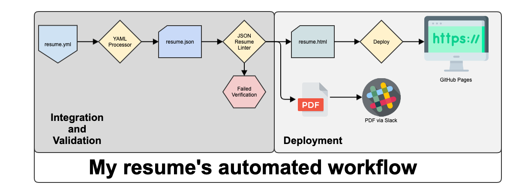

# My Resume Backend

This repo is for my automated resume build structured from of [JSON Resume](https://jsonresume.org/).

This repo contains my work history, overview statement, references, and skill written up to follow the template outlined by the [Schema on jsonresume.org](https://jsonresume.org/schema/)

There is an automated component that will take my `resume.yml` file and convert it to a JSON file that can then be used to convert into any varity of [themes outlined](https://jsonresume.org/themes/). From that I'm able to covert to HTML and serve as a webpage using Gitlab pages. 

## Files

**`resume.yml`**

This the main file that contains my write up of:
* Work Experience
* Relevant Skills
* Basic Information
* Referances

**`resume.json`**

This file is auto-built from the `resume.yml` file

**`.github/workflows/auto_build.yml`**

These are the automated build actions

## Automated Build

This is where Github will use it's CI/CD ('Github workflows') and automate my resume's website. The build steps overview are outlined below:

1) Obtain a know good Linux environment     
2) Install `resume-cli` outlined in the [Getting Started](https://jsonresume.org/getting-started/) section      
3) Convert `resume.yml` to `resume.json` using 

## Picture
- To get my picture: 
- https://api.github.com/users/mrreyes512
- look for avatar_url